# PacifistaBot: Material y Equipos

Dado que es un Kit de iniciación, uno de los puntos más importantes es que el material y equipos necesario para poderse montar no es muy complejo y es fácil de encontrar o de tener disponible. Este es el materila necesario:

### Piezas 3D

Esta es la lista de piezas que hace falta para poder construir el robot humanoide PacifistaBot. Se necesita imprimir todas las piezas numeradas una sola vez, aunque hay que tener en cuenta que algunas de las piezas tienen varios diseños (por ejemplo la cabeza y las manos) a elegir. Los archivos podemos encontrarlos también en el repositorio de [OPRobots de piezas STL](https://github.com/robotaleh/PacifistaBot/tree/master/stl_files) preparadas para imprimirse en 3D o para poder realizar modificaciones gracias al [formato SketchUp](./../3d_model/PacifistaBot.skp).

| Nº   |                           Archivo                            |                         Descripción                          |                            Imagen                            |
| ---- | :----------------------------------------------------------: | :----------------------------------------------------------: | :----------------------------------------------------------: |
| 1    | [PacifistaBot_Torso.stl](../stl_files/PacifistaBot_Torso.stl) |               Pecho o caja torácica del robot.               |   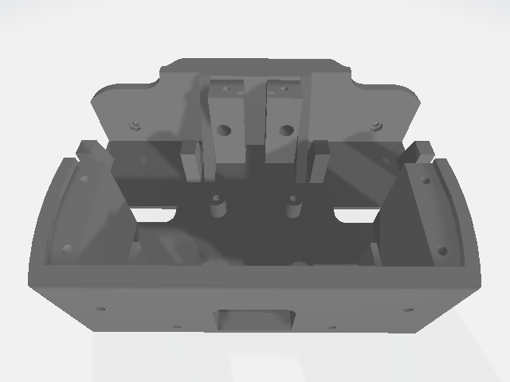   |
| 2    | [PacifistaBot_Cabeza_Lego.stl](../stl_files/PacifistaBot_Cabeza_Lego.stl) |       Cabeza hueca con forma muñeco de lego del robot        | 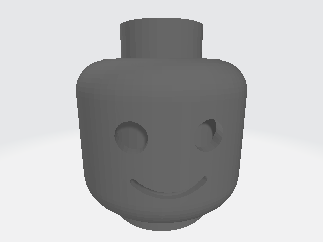 |
| 2    | [PacifistaBot_Cabeza_Pacifista.stl](../stl_files/PacifistaBot_Cabeza_Pacifista.stl) |      Cabeza maciza con forma de Pacifista de One Piece       | 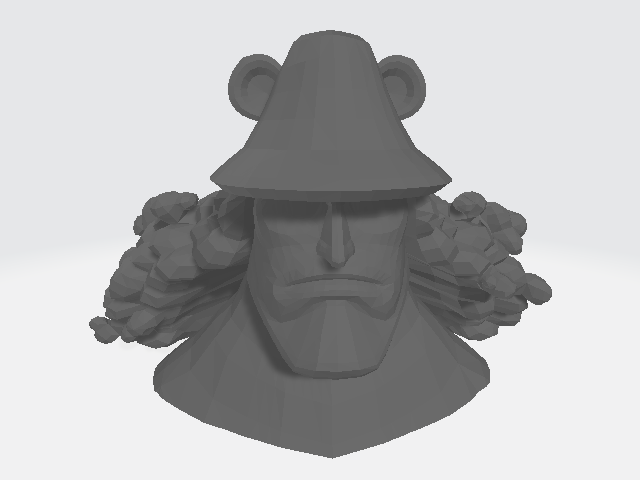 |
| 3    | [PacifistaBot_Cadera.stl](../stl_files/PacifistaBot_Cadera.stl) |                       Cadera del robot                       |  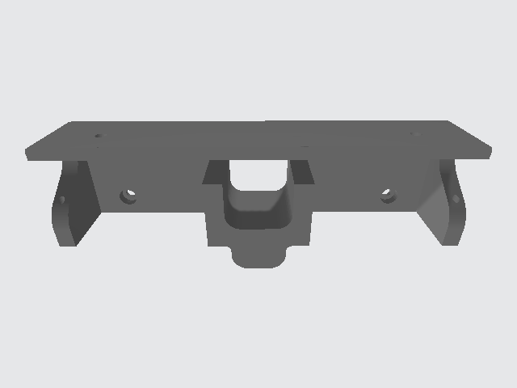   |
| 4    | [PacifistaBot_Codo_Derecho.stl](../stl_files/PacifistaBot_Codo_Derecho.stl) |               Codo del brazo derecho del robot               | 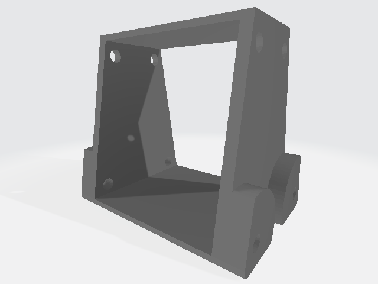 |
| 5    | [PacifistaBot_Codo_Izquierdo.stl](../stl_files/PacifistaBot_Codo_Izquierdo.stl) |              Codo del brazo izquierdo del robot              | 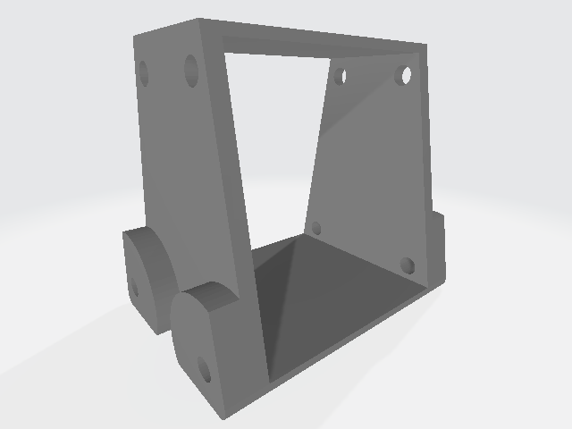 |
| 6    | [PacifistaBot_Hombro_Derecho.stl](../stl_files/PacifistaBot_Hombro_Derecho.stl) |              Hombro del brazo derecho del robot              | 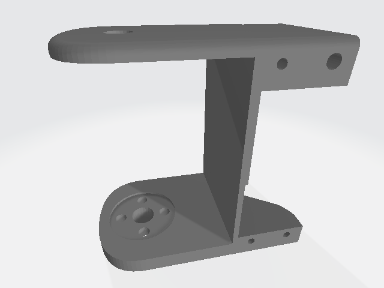 |
| 7    | [PacifistaBot_Hombro_Izquierdo.stl](../stl_files/PacifistaBot_Hombro_Izquierdo.stl) |             Hombro del brazo izquierdo del robot             | 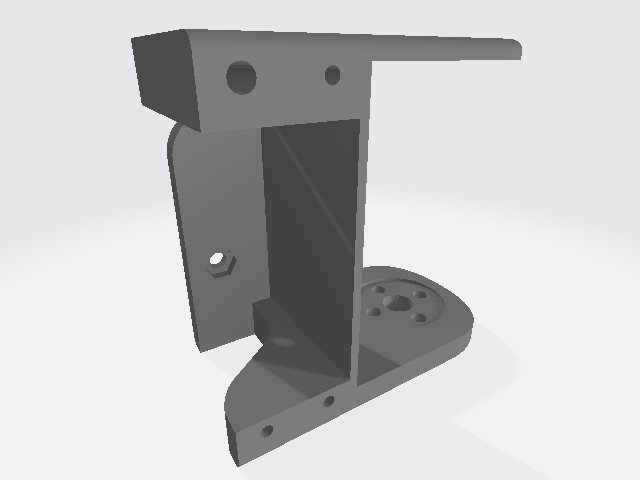 |
| 8    | [PacifistaBot_Ingle_Derecha.stl](../stl_files/PacifistaBot_Ingle_Derecha.stl) |             Ingle de la pierna derecha del robot             | 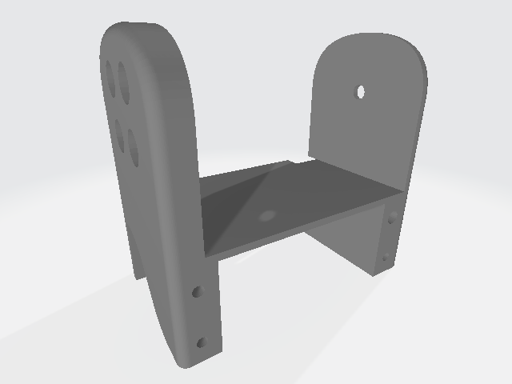 |
| 9    | [PacifistaBot_Ingle_Izquierda.stl](../stl_files/PacifistaBot_Ingle_Izquierda.stl) |            Ingle de la pierna izquierda del robot            | 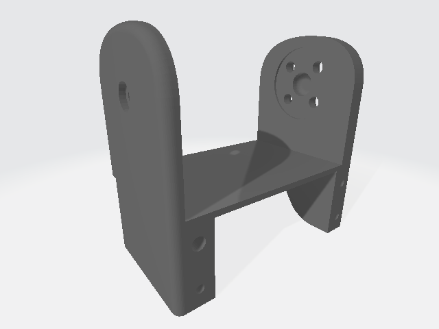 |
| 10   | [PacifistaBot_Link_Frontal_Inferior_Derecho.stl](../stl_files/PacifistaBot_Link_Frontal_Inferior_Derecho.stl) |           Espinilla de la pierna derecha del robot           | 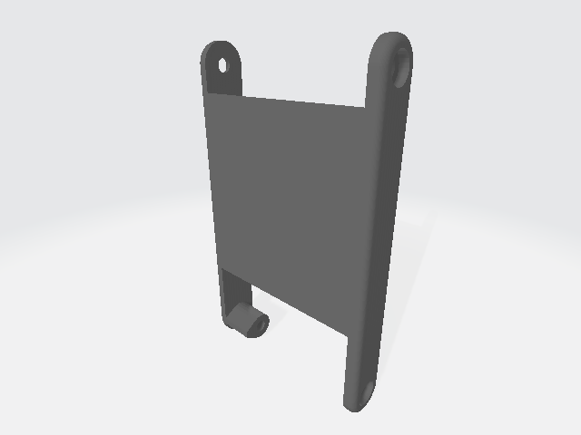 |
| 11   | [PacifistaBot_Link_Frontal_Inferior_Izquierdo.stl](../stl_files/PacifistaBot_Link_Frontal_Inferior_Izquierdo.stl) |          Espinilla de la pierna izquierda del robot          | 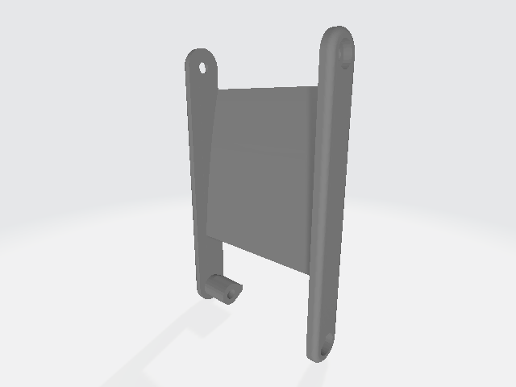 |
| 12   | [PacifistaBot_Link_Frontal_Superior_Derecho.stl](../stl_files/PacifistaBot_Link_Frontal_Superior_Derecho.stl) | Cuádriceps femoral del muslo de la pierna derecha del robot  | 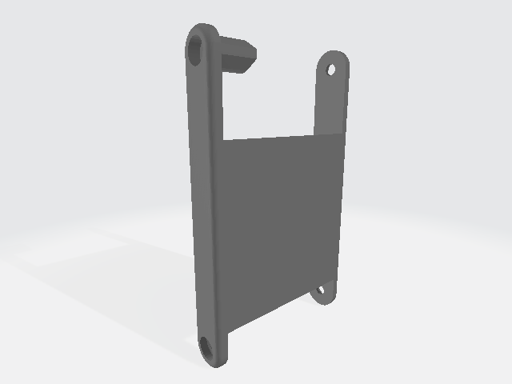 |
| 13   | [PacifistaBot_Link_Frontal_Superior_Izquierdo.stl](../stl_files/PacifistaBot_Link_Frontal_Superior_Izquierdo.stl) | Cuádriceps femoral del muslo de la pierna izquierda del robot | 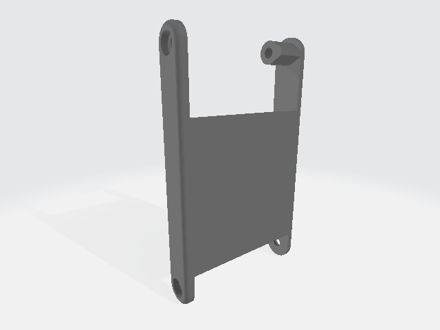 |
| 14   | [PacifistaBot_Link_Mano_Inferior_Frontal_Brazo _Derecho.stl](../stl_files/PacifistaBot_Link_Mano_Inferior_Frontal_Brazo Derecho.stl) |          Antebrazo palmar frontal derecho del robot          | 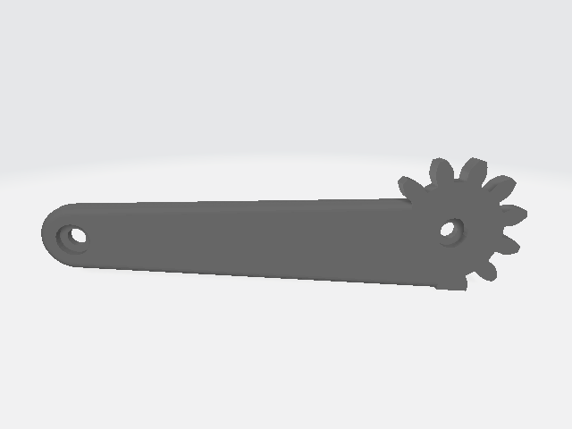 |
| 15   | [PacifistaBot_Link_Mano_Inferior_Frontal_Brazo _Izquierdo.stl](../stl_files/PacifistaBot_Link_Mano_Inferior_Frontal_Brazo_Izquierdo.stl) |         Antebrazo palmar frontal izquierdo del robot         | 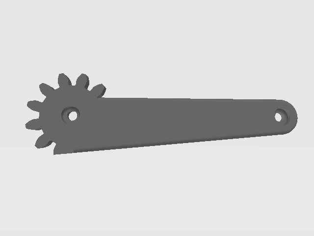 |
| 16   | [PacifistaBot_Link_Mano_Inferior_Trasero_Brazo _Derecho.stl](../stl_files/PacifistaBot_Link_Mano_Inferior_Trasero_Brazo_Derecho.stl) |          Antebrazo palmar trasero derecho del robot          | 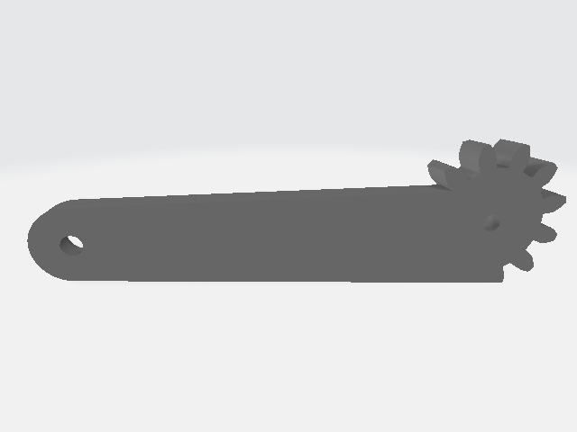 |
| 17   | [PacifistaBot_Link_Mano_Inferior_Trasero_Brazo _Izquierdo.stl](../stl_files/PacifistaBot_Link_Mano_Inferior_Trasero_Brazo_Izquierdo.stl) |         Antebrazo palmar trasero izquierdo del robot         |  |
| 18   | [PacifistaBot_Link_Mano_Superior_Brazo _Derecho.stl](../stl_files/PacifistaBot_Link_Mano_Superior_Brazo_Derecho.stl) |            Antebrazo supinador derecho del robot             | 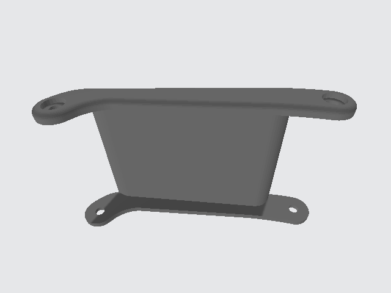 |
| 19   | [PacifistaBot_Link_Mano_Superior_Brazo _Izquierdo.stl](../stl_files/PacifistaBot_Link_Mano_Superior_Brazo_Izquierdo.stl) |           Antebrazo supinador izquierdo del robot            | 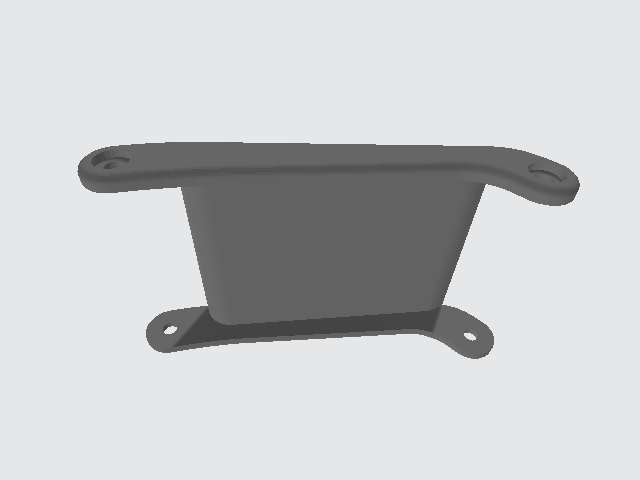 |
| 20   | [PacifistaBot_Link_Servo_Inferior_Frontal_Brazo _Derecho.stl](../stl_files/PacifistaBot_Link_Servo_Inferior_Frontal_Brazo_Derecho.stl) |         Triceps frontal del brazo derecho del robot          | 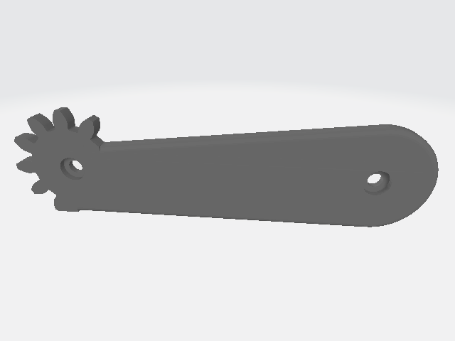 |
| 21   | [PacifistaBot_Link_Servo_Inferior_Frontal_Brazo _Izquierdo.stl](../stl_files/PacifistaBot_Link_Servo_Inferior_Frontal_Brazo_Izquierdo.stl) |        Triceps frontal del brazo izquierdo del robot         | 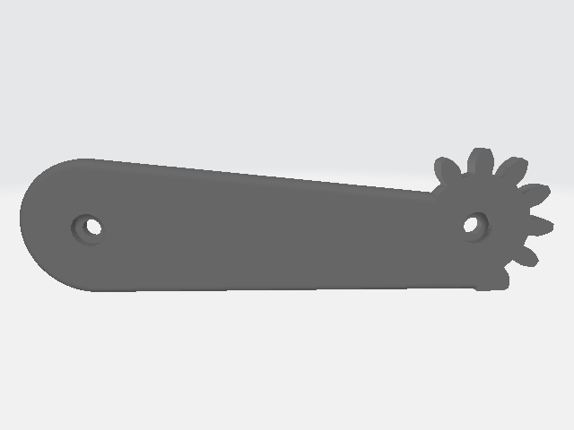 |
| 22   | [PacifistaBot_Link_Servo_Inferior_Trasero_Brazo _Derecho.stl](../stl_files/PacifistaBot_Link_Servo_Inferior_Trasero_Brazo_Derecho.stl) |         Triceps trasero del brazo derecho del robot          | 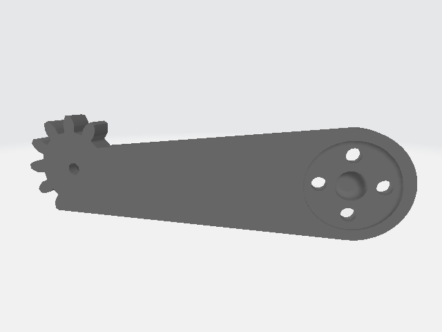 |
| 23   | [PacifistaBot_Link_Servo_Inferior_Trasero_Brazo _Izquierdo.stl](../stl_files/PacifistaBot_Link_Servo_Inferior_Trasero_Brazo_Izquierdo.stl) |        Triceps trasero del brazo izquierdo del robot         | 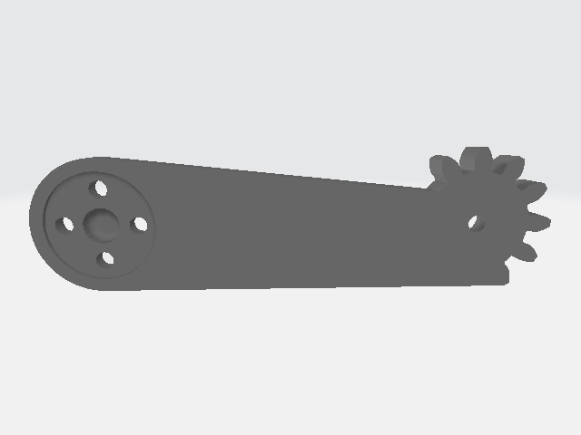 |
| 24   | [PacifistaBot_Link_Servo_Superior_Brazo _Derecho.stl](../stl_files/PacifistaBot_Link_Servo_Superior_Brazo_Derecho.stl) |              Biceps del brazo derecho del robot              | 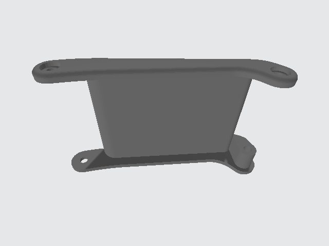 |
| 25   | [PacifistaBot_Link_Servo_Superior_Brazo _Izquierdo.stl](../stl_files/PacifistaBot_Link_Servo_Superior_Brazo_Izquierdo.stl) |             Biceps del brazo izquierdo del robot             | 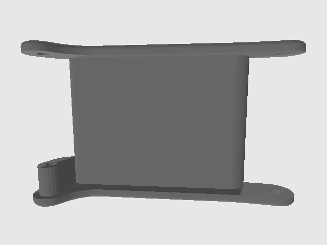 |
| 26   | [PacifistaBot_Link_Trasero_Inferior_Derecho.stl](../stl_files/PacifistaBot_Link_Trasero_Inferior_Derecho.stl) |            Gemelo de la pierna derecha del robot             | 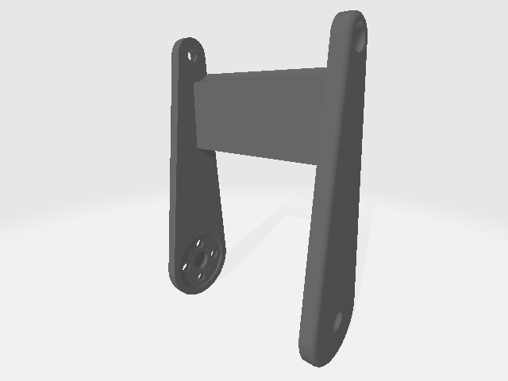 |
| 27   | [PacifistaBot_Link_Trasero_Inferior_Izquierdo.stl](../stl_files/PacifistaBot_Link_Trasero_Inferior_Izquierdo.stl) |           Gemelo de la pierna izquierda del robot            | 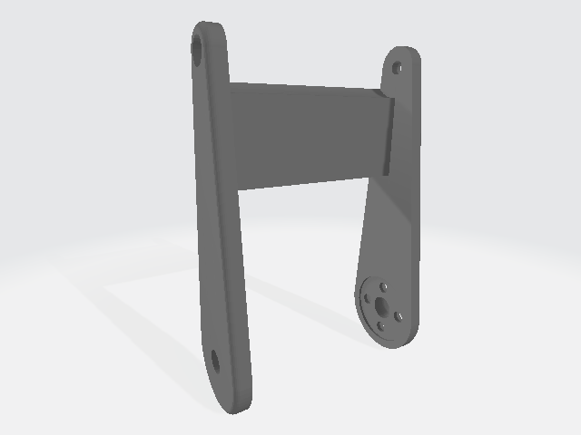 |
| 28   | [PacifistaBot_Link_Trasero_Superior_Derecho.stl](../stl_files/PacifistaBot_Link_Trasero_Superior_Derecho.stl) |        Biceps femoral de la pierna derecha del robot         | 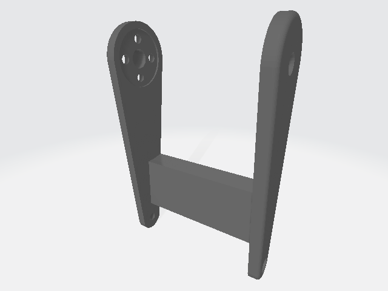 |
| 29   | [PacifistaBot_Link_Trasero_Superior_Izquierdo.stl](../stl_files/PacifistaBot_Link_Trasero_Superior_Izquierdo.stl) |       Biceps femoral de la pierna izquierda del robot        | 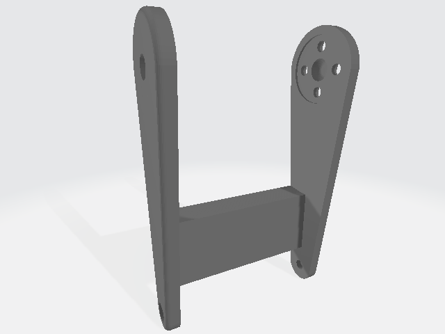 |
| 30   | [PacifistaBot_Mano_Lego_Derecha.stl](../stl_files/PacifistaBot_Mano_Lego_Derecha.stl) |      Mano derecha con forma de muñeco de lego del robot      | 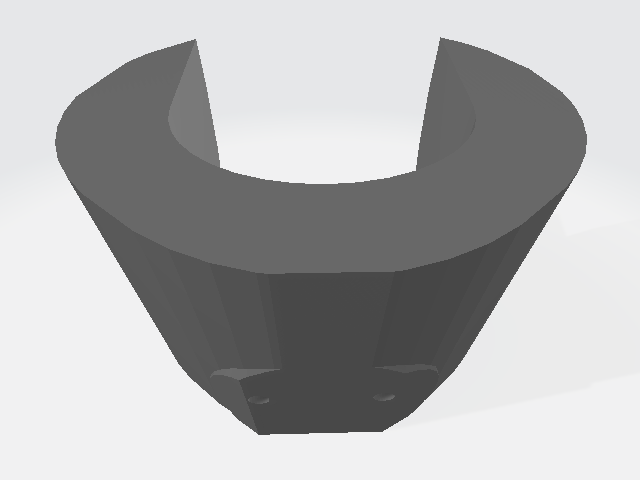 |
| 31   | [PacifistaBot_Mano_Lego_Izquierda.stl](../stl_files/PacifistaBot_Mano_Lego_Izquierda.stl) |     Mano izquierda con forma de muñeco de lego del robot     | 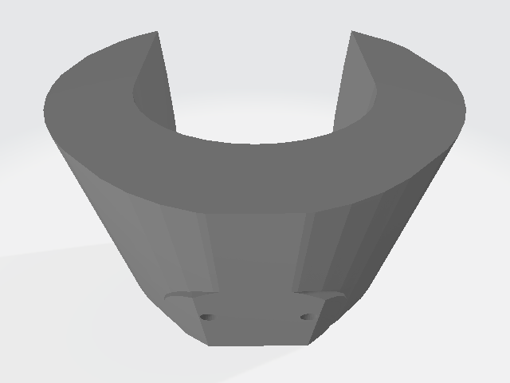 |
| 30   | [PacifistaBot_Mano_Pacifista_Derecha.stl](../stl_files/PacifistaBot_Mano_Pacifista_Derecha.stl) |  Mano derecha con forma de Pacifista de One Piece del robot  | 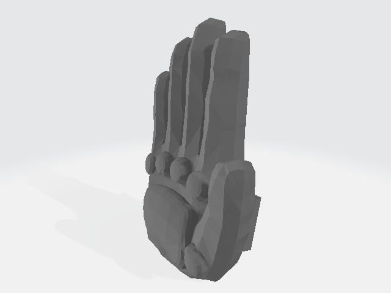 |
| 31   | [PacifistaBot_Mano_Pacifista_Izquierda.stl](../stl_files/PacifistaBot_Mano_Pacifista_Izquierda.stl) | Mano izquierda con forma de Pacifista de One Piece del robot | 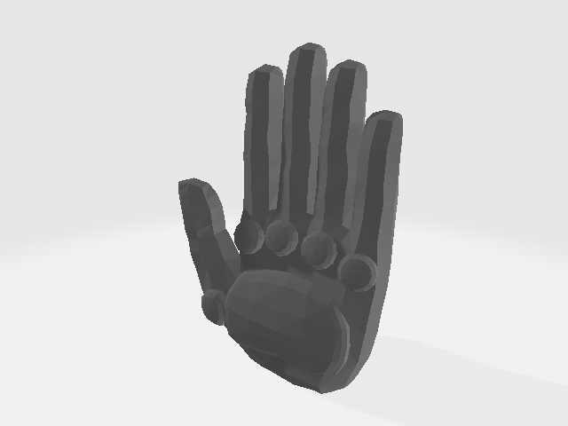 |
| 32   | [PacifistaBot_Muñeca_Derecha.stl](../stl_files/PacifistaBot_Muñeca_Derecha.stl) |             Muñeca de la mano derecha del robot              |  |
| 33   | [PacifistaBot_Muñeca_Izquierda.stl](../stl_files/PacifistaBot_Muñeca_Izquierda.stl) |            Muñeca de la mano izquierda del robot             |  |
| 34   | [PacifistaBot_Pie_Derecho.stl](../stl_files/PacifistaBot_Pie_Derecho.stl) |          Pie derecho de la pierna derecha del robot          | 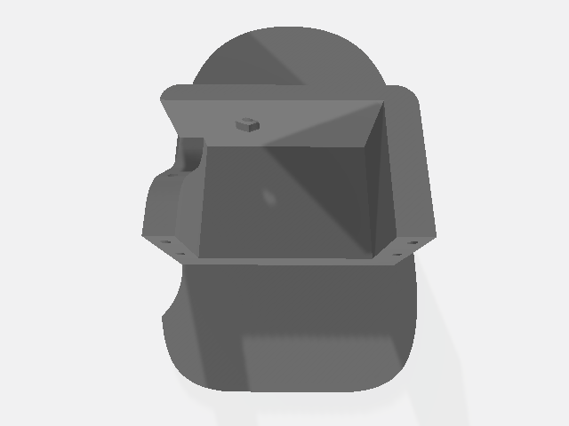 |
| 35   | [PacifistaBot_Pie_Izquierdo.stl](../stl_files/PacifistaBot_Pie_Izquierdo.stl) |         Pie izquierdo de la pierna derecha del robot         | 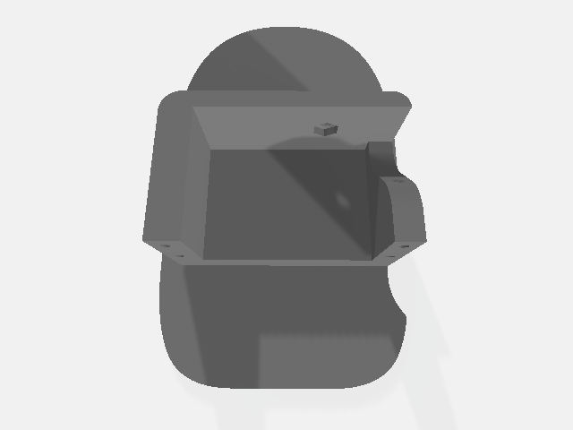 |
| 36   | [PacifistaBot_Rodilla_Derecha.stl](../stl_files/PacifistaBot_Rodilla_Derecha.stl) |            Rodilla de la pierna derecha del robot            | 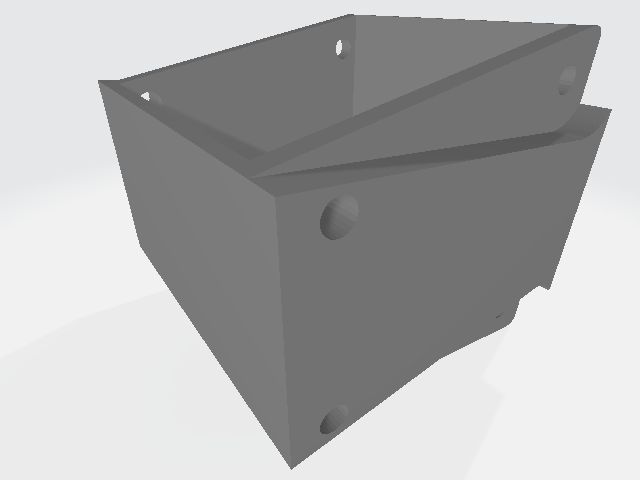 |
| 37   | [PacifistaBot_Rodilla_Izquierda.stl](../stl_files/PacifistaBot_Rodilla_Izquierda.stl) |           Rodilla de la pierna izquierda del robot           | 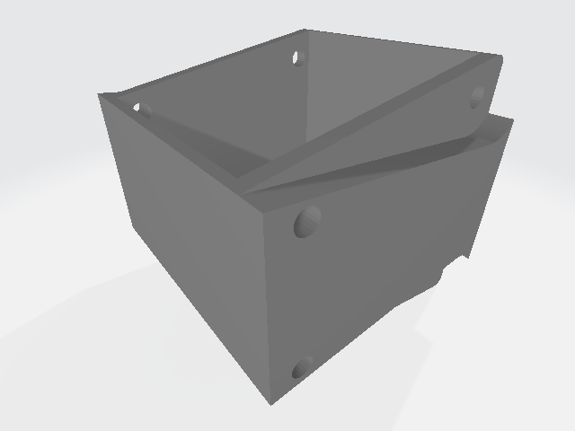 |
| 38   | [PacifistaBot_Tobillo_Derecho.stl](../stl_files/PacifistaBot_Tobillo_Derecho.stl) |            Tobillo de la pierna derecha del robot            | 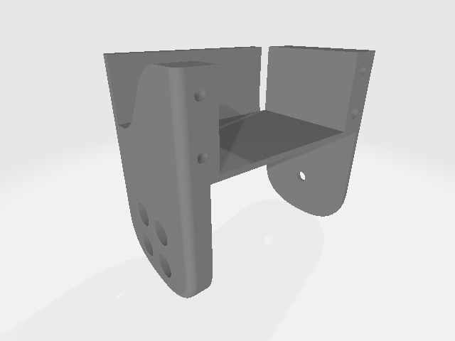 |
| 39   | [PacifistaBot_Tobillo_Izquierdo.stl](../stl_files/PacifistaBot_Tobillo_Izquierdo.stl) |           Tobillo de la pierna izquierda del robot           | 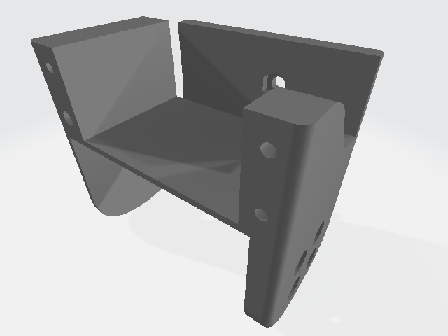 |
| 40   | [PacifistaBot_Torso_Tapa.stl](../stl_files/PacifistaBot_Torso_Tapa.stl) |               Tapa trasera del torso del robot               | 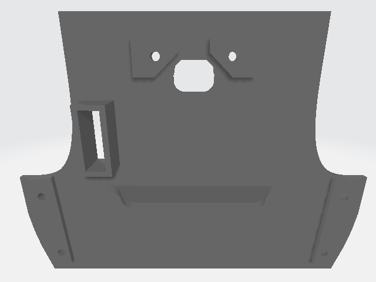 |

### Componentes Mecánicos

A continuación se listan los componentes mecánicos necesarios para la construcción del robot PacifistaBot. Todos los componentes mecánicos y electrónicos han sido suministrados por [OPRobots](https://twitter.com/oprobots) por unos 100 euros, se va a ir identificando los componentes para que los alumnos y profesores puedan ir gestionando la adquisición de ellos. Junto al nombre de cada componente se ha puesto un link orientativo para poder tener una idea de donde comprar el componente. El número de tornillos deben sobrar algunos ya que los valores no están ajustados.

|  Nº  |                        Nombre/Compra                         |                         Descripción                          |                            Imagen                            |
| :--: | :----------------------------------------------------------: | :----------------------------------------------------------: | :----------------------------------------------------------: |
|  12  | [Tornillo M3x8](https://es.aliexpress.com/wholesale?catId=0&initiative_id=SB_20190314011904&isPremium=y&SearchText=allen+m3x8) |         Tornillo métrico allen cab. cilíndrica M3x8          |   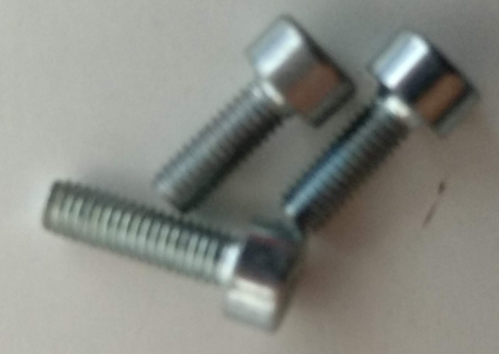    |
|  33  | [Tornillo M3x10](https://es.aliexpress.com/wholesale?catId=0&initiative_id=SB_20190314011941&isPremium=y&SearchText=allen+m3x10) |         Tornillo métrico allen cab. cilíndrica M3x10         |   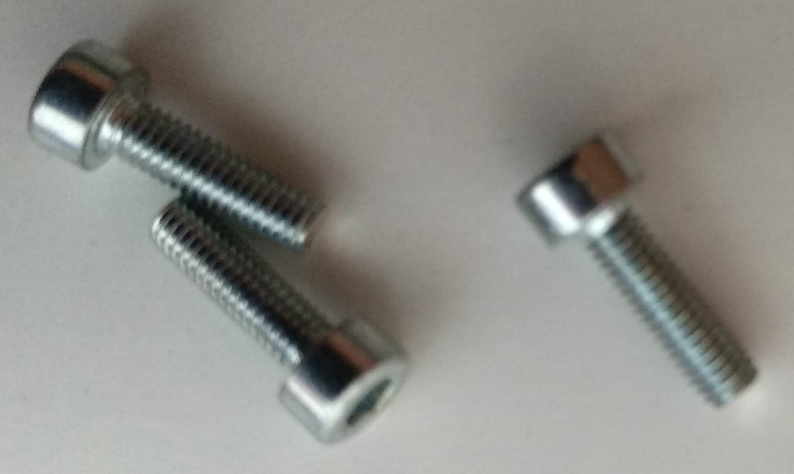   |
|  35  | [Tornillo M3x16](https://es.aliexpress.com/wholesale?catId=0&initiative_id=SB_20190314012016&isPremium=y&SearchText=allen+m3x16) |         Tornillo métrico allen cab. cilíndrica M3x16         |   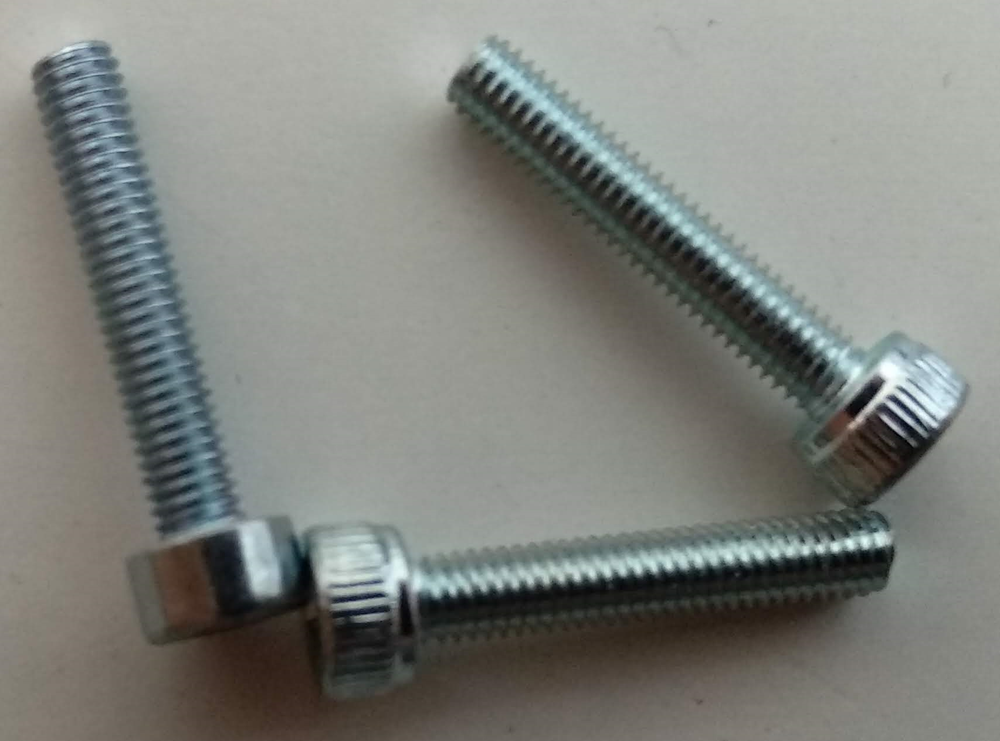   |
|  10  | [Tornillo M3x25](https://es.aliexpress.com/wholesale?catId=0&initiative_id=SB_20190314012501&isPremium=y&SearchText=allen+m3x25) | Tornillo métrico allen cab. cilíndrica M3x25 (19 mm roscado) |   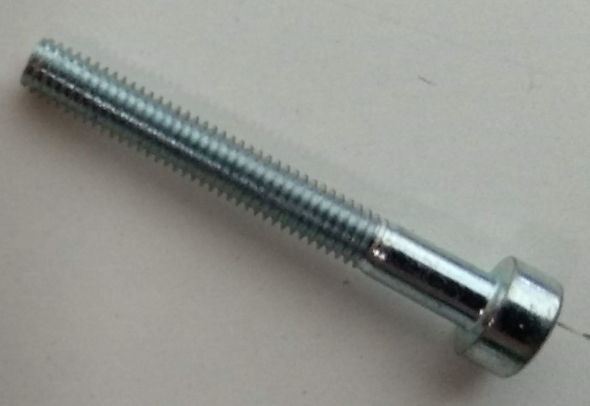   |
|  12  | [Servomotor](https://es.aliexpress.com/wholesale?catId=0&initiative_id=SB_20190314012523&isPremium=y&SearchText=MG996R) |         Servomotor Tower pro MG996R corona metálica          |    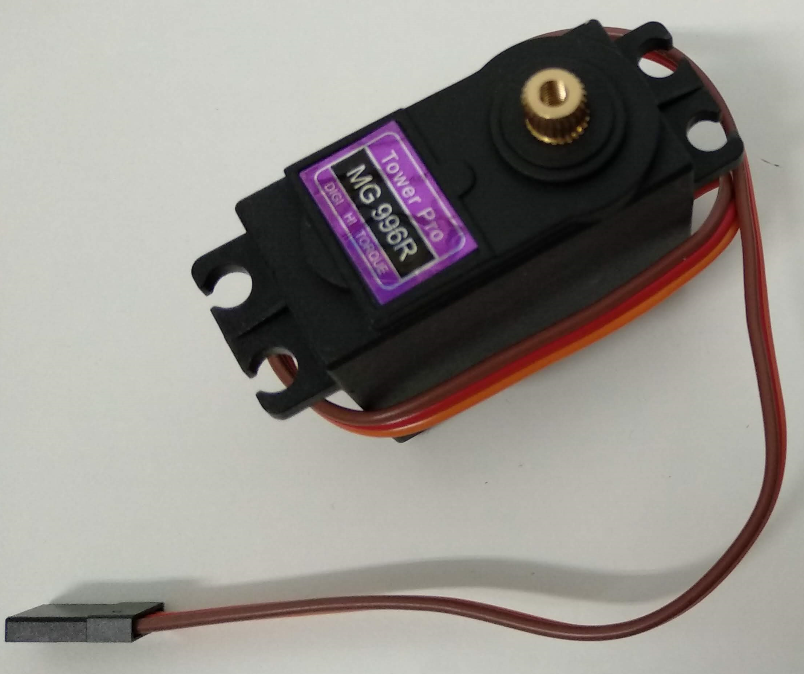    |
|  12  | [Accesorios servos](https://es.aliexpress.com/wholesale?catId=0&initiative_id=SB_20190314012523&isPremium=y&SearchText=MG996R) | Bolsa de varios accesorios de los servomotores. De la bolsa solo se usan los 4 tornillos roscados para amarrar los servomotres |     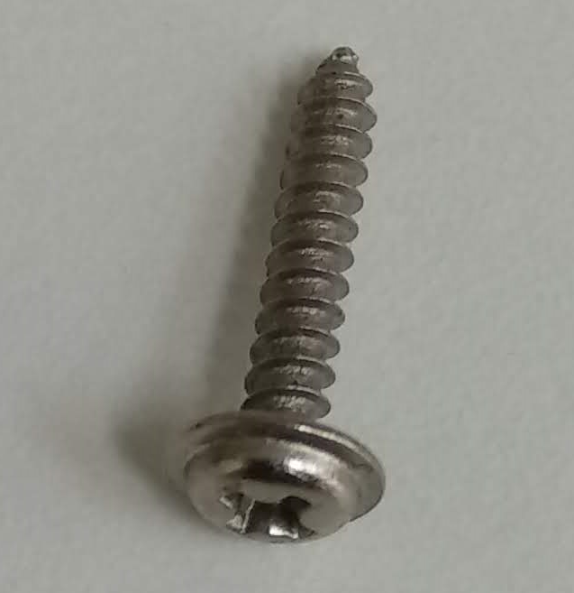     |
|  12  | [Disco engranado metálico](https://es.aliexpress.com/wholesale?catId=0&initiative_id=SB_20190314013124&isPremium=y&SearchText=MG996R+Disc) |         Disco engranado metálico de los servomotores         |     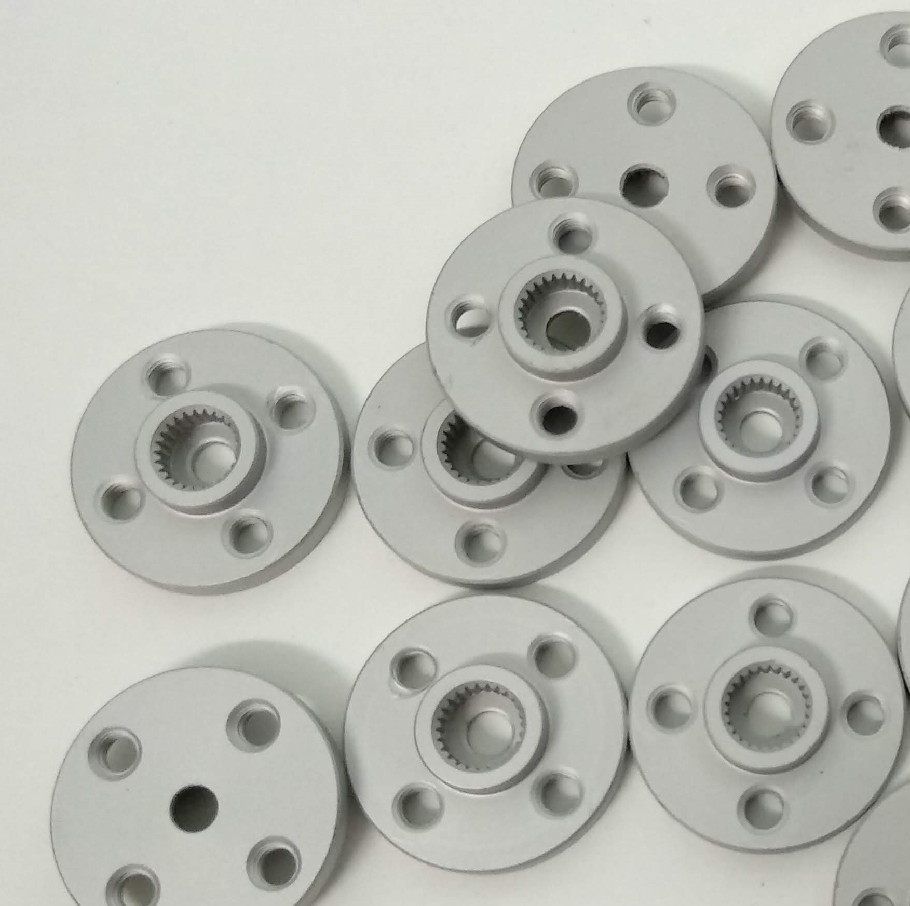      |
|  48  | [Tornillo M3x5](https://es.aliexpress.com/wholesale?catId=0&initiative_id=SB_20190314013124&isPremium=y&SearchText=MG996R+Disc) | Tornillos métricos philips de acero M3x5 para las pletinas metálicas |   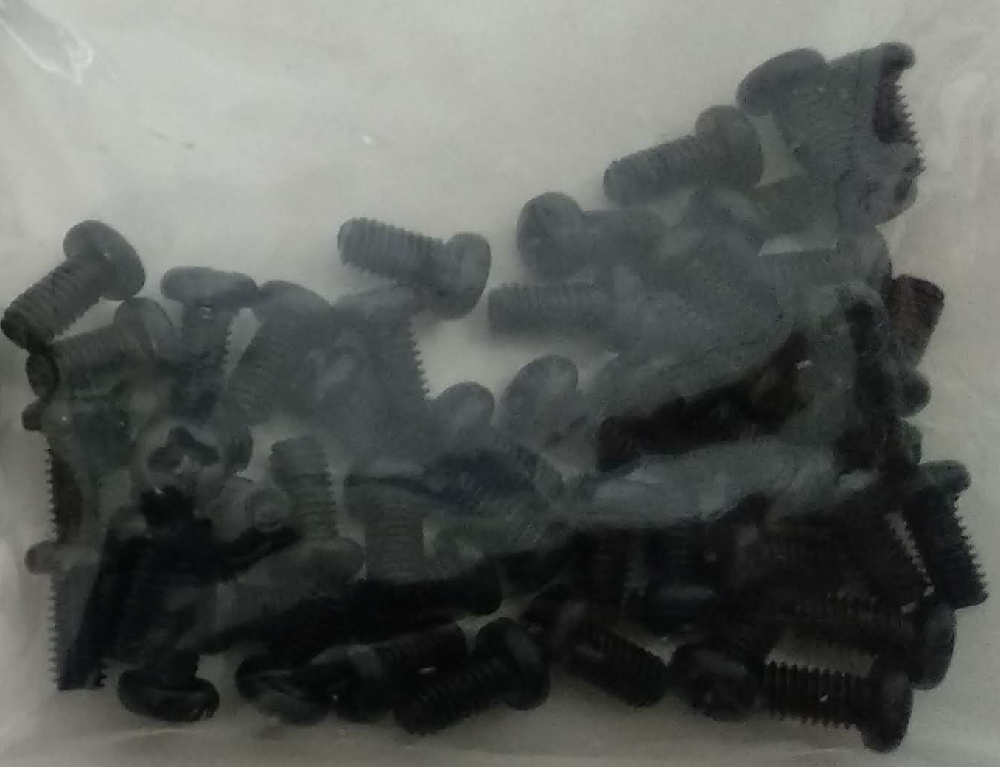    |
|  70  | [Tuerca M3](https://es.aliexpress.com/wholesale?catId=0&initiative_id=SB_20190314013524&isPremium=y&SearchText=tuerca+m3+autoblocantes) |                     Tuercas autoblock M3                     |      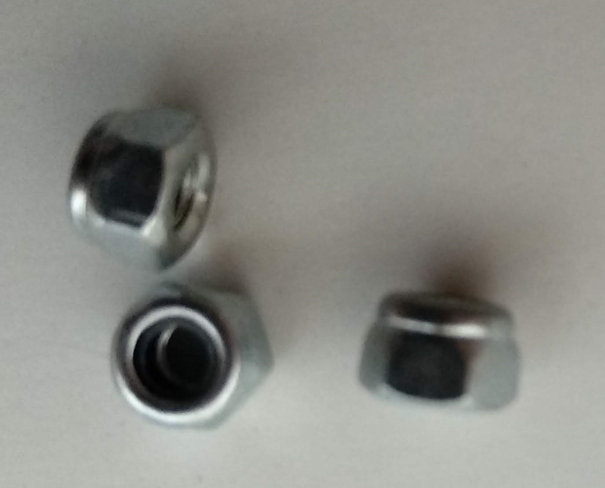      |
|  4   | [Alargadores](https://www.aliexpress.com/wholesale?catId=0&initiative_id=SB_20190314013830&isPremium=y&SearchText=servo+extension+cable+200) |           Alargadores 21,5cm para los servomotores           | 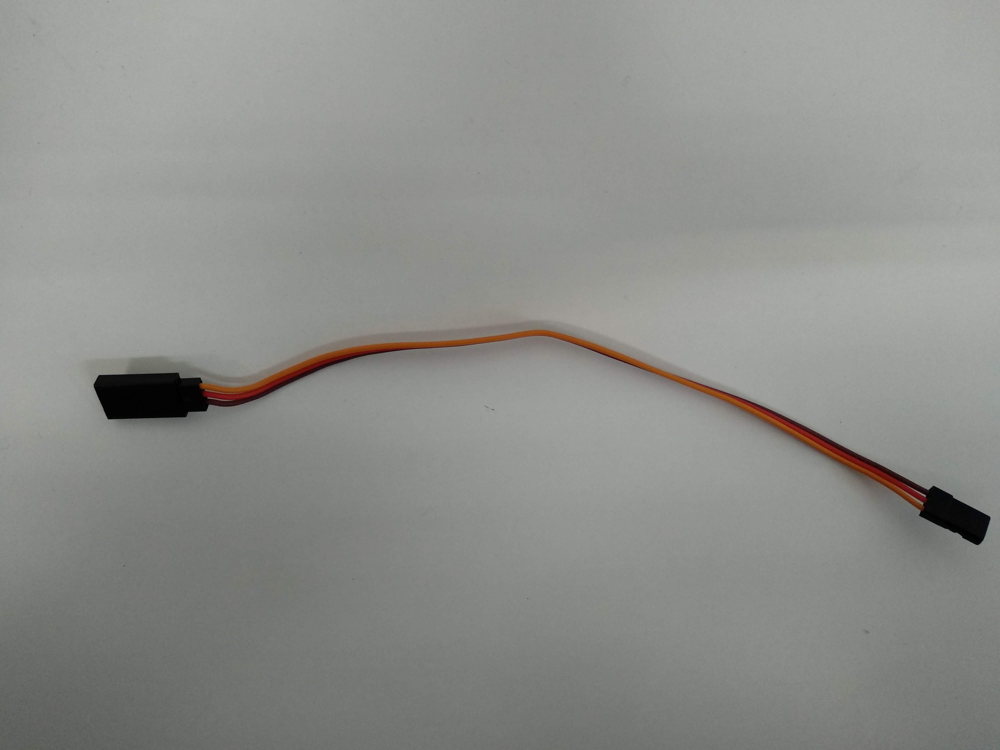 |

### Componentes Electrónicos

A continuación se listan los componentes electrónicos necesarios para la construcción del robot PacifistaBot. Todos los componentes mecánicos y electrónicos han sido suministrados por [OPRobots](https://twitter.com/oprobots) por unos 100 euros, se va a ir identificando los componentes para que los alumnos y profesores puedan ir gestionando la adquisición de ellos. Junto al nombre de cada componente se ha puesto un link orientativo para poder tener una idea de donde comprar el componente. El PCB está [diseñado por OPRobots en Kicad](../Pacifista_BT/pcb_files) por lo que cualquiera puede consultar los esquemas y modificarlos. He pasado el [esquema a PDF](../pcb_files/Pacifista_BT/Esquema.pdf) para poder consultarlo sin necesidad de tener instalado Kicad. Además OPRobots ha creado los [gerber del circuito](../pcb_files/Pacifista_BT/gerbers) para que cualquiera pueda enviarlos a fabricar a alguno de los fabricantes como [pcbway](https://www.pcbway.com/), [seeedstudio](https://www.seeedstudio.com/fusion.html) ... (no me llevo comisión).

|  Nº  |                        Nombre/Compra                         |                         Descripción                          |                            Imagen                            |
| :--: | :----------------------------------------------------------: | :----------------------------------------------------------: | :----------------------------------------------------------: |
|  1   |           [PCB](../pcb_files/Pacifista_BT/gerbers)           |  Circuito impreso para la electrónica de control del robot.  |     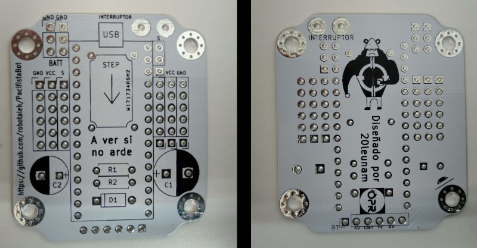      |
|  1   | [Batería](https://hobbyking.com/es_es/zippy-flightmax-1100mah-6-6v-lifepo4-2s1p-receiver-pack.html) |                 Batería LiFe 2S 1100 mah 10C                 |   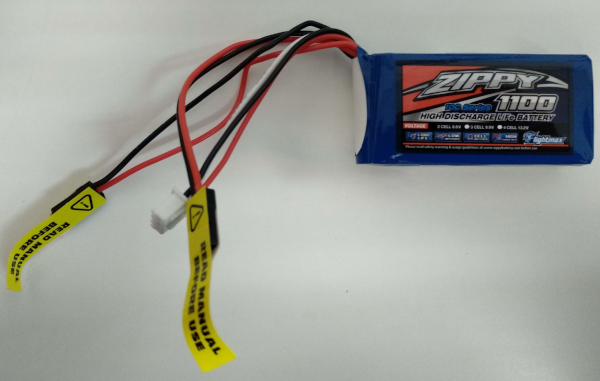    |
|  1   | [Arduino nano](https://www.aliexpress.com/wholesale?catId=0&initiative_id=SB_20190314014220&isPremium=y&SearchText=arduino+nano) |         Placa Arduino nano con los pines de conexión         |   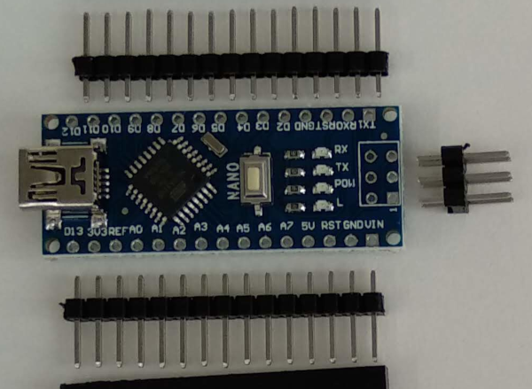    |
|  1   | [Condensador](https://www.aliexpress.com/wholesale?catId=0&initiative_id=SB_20190314014249&isPremium=y&SearchText=capacitor+1000uf+16v) |                 Condensador de 16V y 1000uF                  |    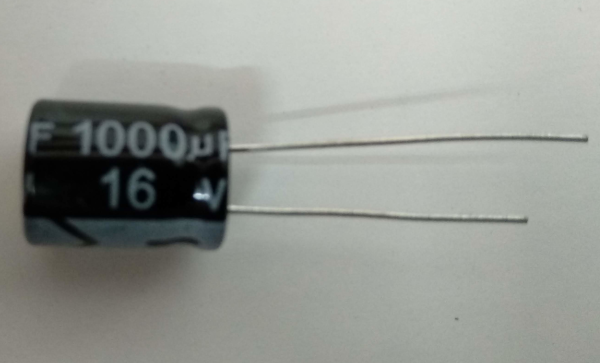     |
|  1   | [Condensador](https://www.aliexpress.com/wholesale?catId=0&initiative_id=SB_20190314014325&isPremium=y&SearchText=capacitor+820uf+6%2C3v) |                 Condensador de 6,3V y 820uF                  |     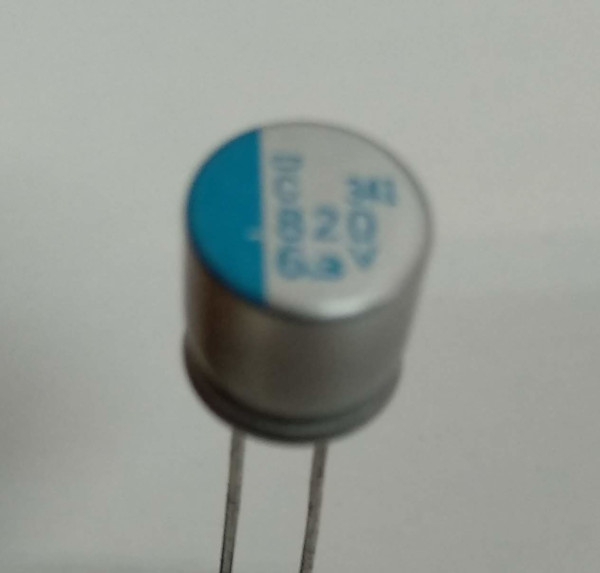     |
|  1   | [Bluetooth](https://www.aliexpress.com/wholesale?catId=0&initiative_id=SB_20190314014409&isPremium=y&SearchText=bluetooth+hc-05) |           Módulo Bluetooth HC-05 6 pines y 1 botón           |      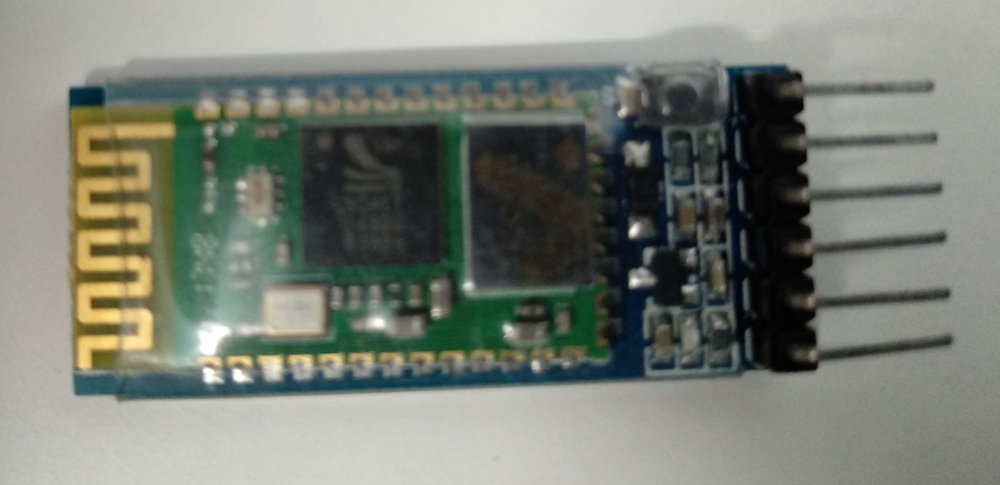      |
|  1   | [Regulador dc-dc](https://www.aliexpress.com/wholesale?catId=0&initiative_id=SB_20190314014430&isPremium=y&SearchText=dc-dc+MINI-360) |          Regulador dc-dc MINI-360 con potenciómetro          |    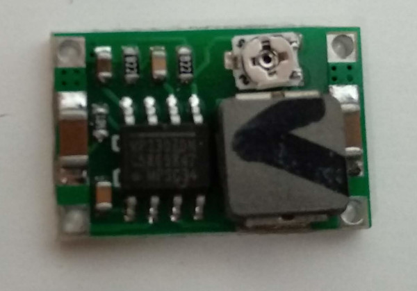     |
|  5   | [Tira de 6 pines](https://www.aliexpress.com/wholesale?catId=0&initiative_id=SB_20190314014549&isPremium=y&SearchText=tira+de+pines+negro+amarillo+rojo+blanco) | Tira de pines paso 2.54 2x6pines negro, rojo y 1x6pines amarillo |  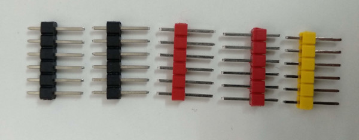  |
|  1   | [Tira de 9 pines](https://www.aliexpress.com/wholesale?catId=0&initiative_id=SB_20190314014549&isPremium=y&SearchText=tira+de+pines+negro+amarillo+rojo+blanco) |          Tira de pines paso 2.54 1x9pines amarillo           |  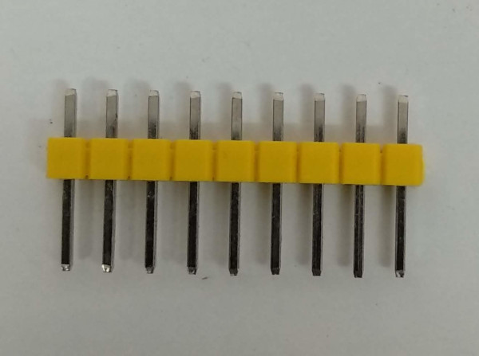  |
|  3   | [Tira de 2 pines](https://www.aliexpress.com/wholesale?catId=0&initiative_id=SB_20190314014549&isPremium=y&SearchText=tira+de+pines+negro+amarillo+rojo+blanco) |     Tira de pines paso 2.54 1x2pines negro, rojo, blanco     |  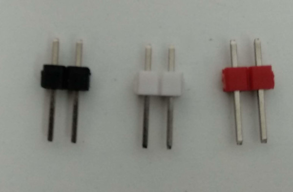  |
|  1   | [Tira de 4 pines](https://www.aliexpress.com/wholesale?catId=0&initiative_id=SB_20190314014549&isPremium=y&SearchText=tira+de+pines+negro+amarillo+rojo+blanco) |            Tira de pines paso 2.54 1x4pines negro            |  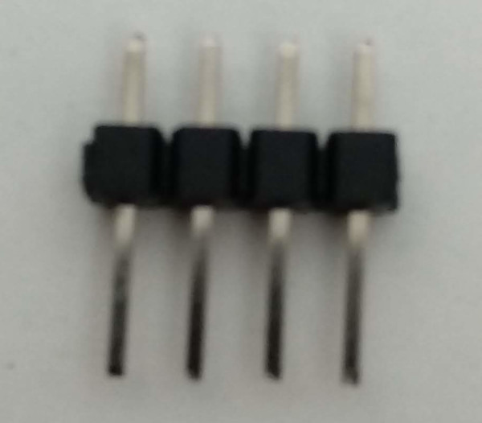  |
|  2   | [Tira de 15 pines hembra](https://www.aliexpress.com/wholesale?catId=0&initiative_id=SB_20190314014635&isPremium=y&SearchText=tira+de+pines+hembra) |        Tira de pines hembra paso 2.54 1x15pines negro        | 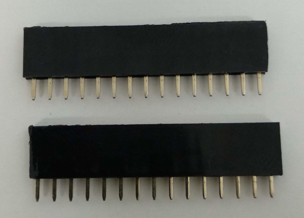  |
|  1   | [Tira de 6 pines hembra](https://www.aliexpress.com/wholesale?catId=0&initiative_id=SB_20190314014718&isPremium=y&SearchText=tira+de+pines+hembra+angle) |        Tira de pines hembra paso 2.54 1x6pines negro         | 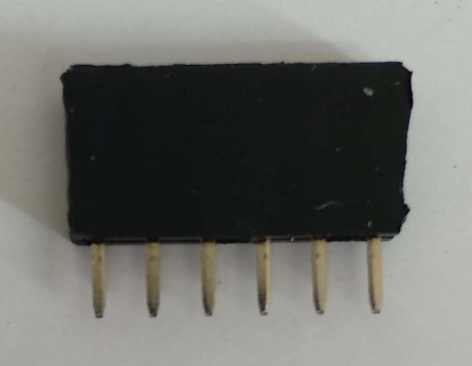 |
|  1   | [Diodo](https://www.aliexpress.com/wholesale?catId=0&initiative_id=SB_20190314014742&isPremium=y&SearchText=1N4007) |                         Diodo 1N4007                         |    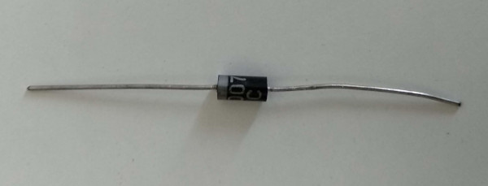     |
|  2   | [Resistencias](https://www.aliexpress.com/wholesale?catId=0&initiative_id=SB_20190314014842&isPremium=y&SearchText=resistor+1k+1%2F4w+1%25) |     Resistencia 10kΩ con tolerancia %1 y potencia 1/4 W      | 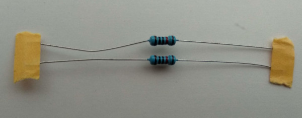 |
|  1   |                            Switch                            |                   Interruptor KCD1 8A-250V                   |    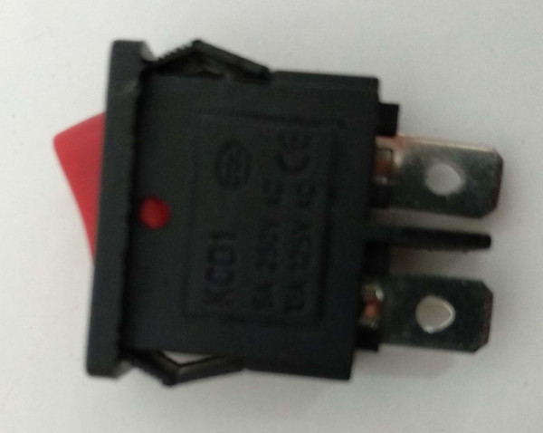    |
|  2   |                      Conectores faston                       |                Conector faston cable de 13cm                 |   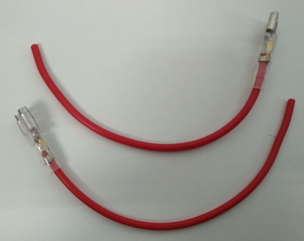   |
|  1   | [Carrete de estaño](https://www.aliexpress.com/wholesale?catId=0&initiative_id=SB_20190314015213&isPremium=y&SearchText=esta%C3%B1o) |                Carrete de estaño para soldar                 |    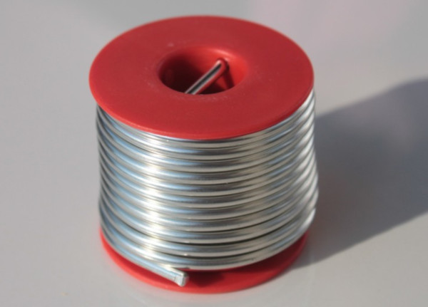    |
|  1   | [Cable miniUSB](https://www.aliexpress.com/wholesale?catId=0&initiative_id=SB_20190314015354&isPremium=y&SearchText=usb+miniusb) |                     Cable USB a miniUSB                      |   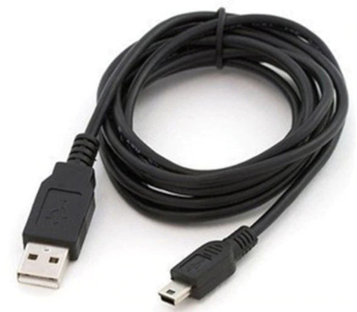    |

### Equipos y herramientas

Esta es la lista de equipos y herramientas necesarias tanto para el montaje como para el uso y mantenimiento del robot. En la lista aparece lo recomendado algunos no son obligatorios(Tienen un guión "-" en el nombre) o varios tinen la misma función (Tienen un asterisko y un nombre "*1" en el nombre).

|  Nº  |         Nombre         |                Descripción                |                          Imagen                          |
| :--: | :--------------------: | :---------------------------------------: | :------------------------------------------------------: |
|  1   |      Llave allen       |            Llave allen de 1,5             |      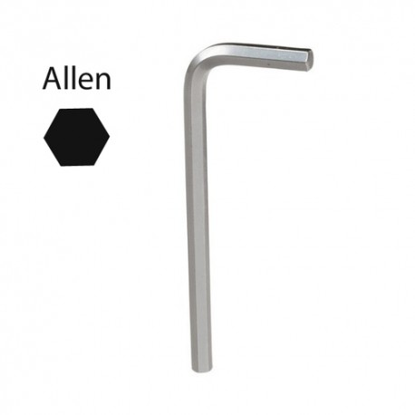      |
|  1   | Destornillador philips | Destornillador philips de PH00, PH0 y PH1 |     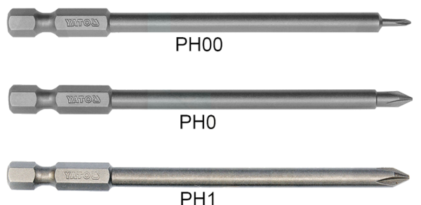     |
|  1   |      Alicates *2       |          Alicates de punta fina           |     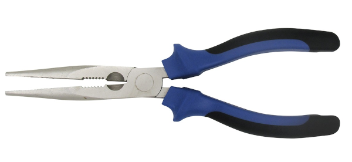     |
|  1   |     Llave fija *2      |  Llave fija para cabeza hexagonal de 5,5  |    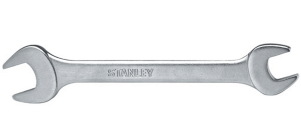    |
|  1   |       Estañador        |       Estañador de 30W y punta fina       |    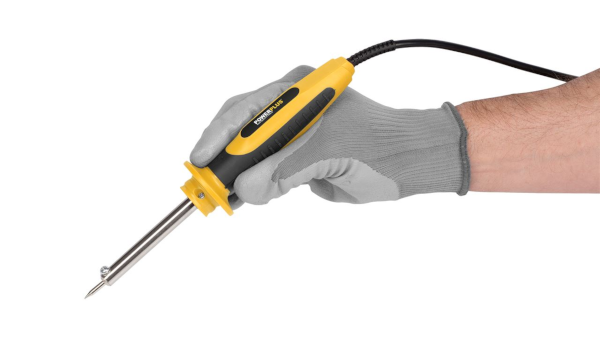     |
|  1   |       Tijeras *1       |          Tijeras de electricista          |     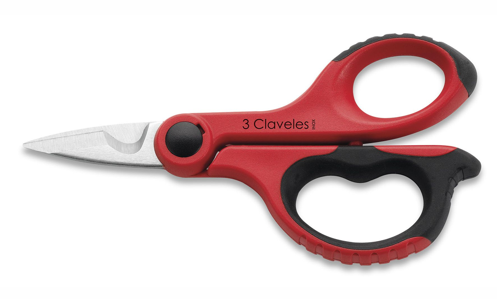     |
|  1   |      Cortante *1       |        Cortante de pequeño tamaño         |    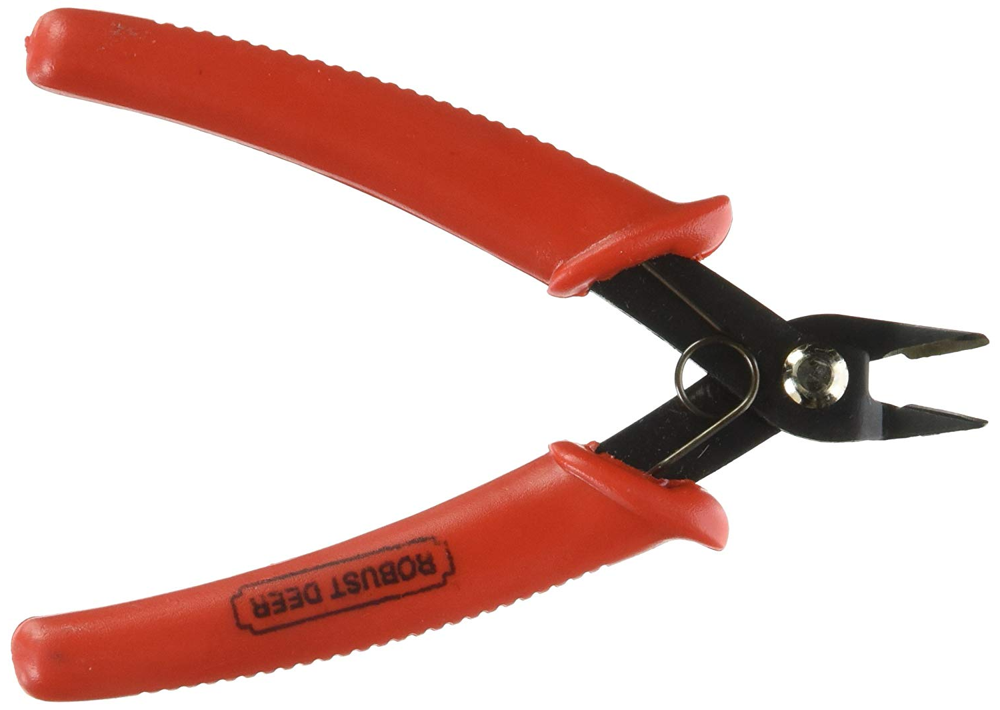     |
|  1   |      - Polímetro       |     Polímetro para medir hasta 10 Vcc     |    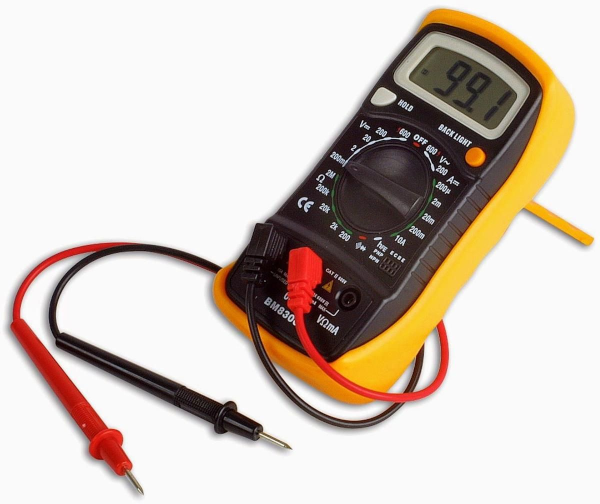    |
|  1   |    PC con Bluetooth    |         PC con conexión Bluetooth         |         |
|  1   |      - Protoboard      |      Protoboard de cualquier tamaño       |   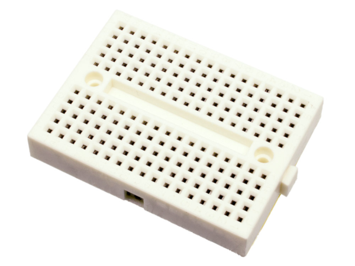    |
|  1   |  Cargador de batería   |         Cargador de baterias LiFe         | 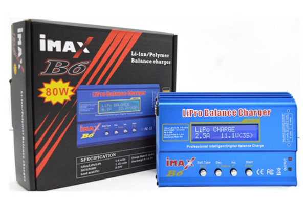 |

