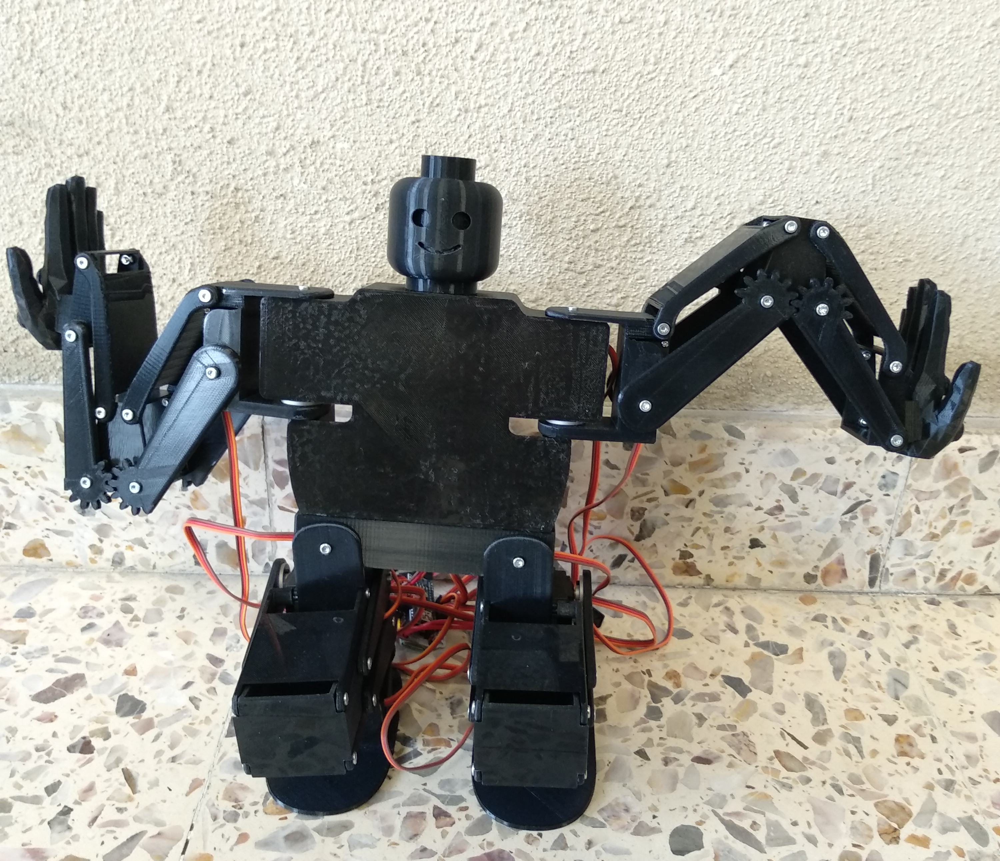
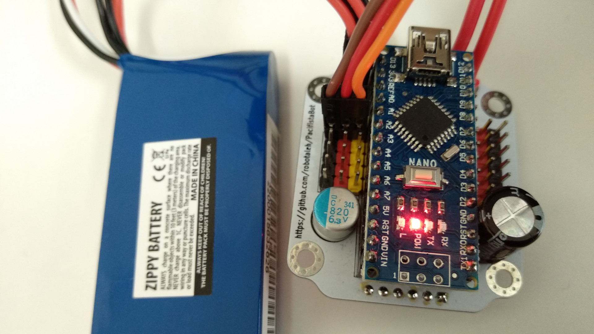
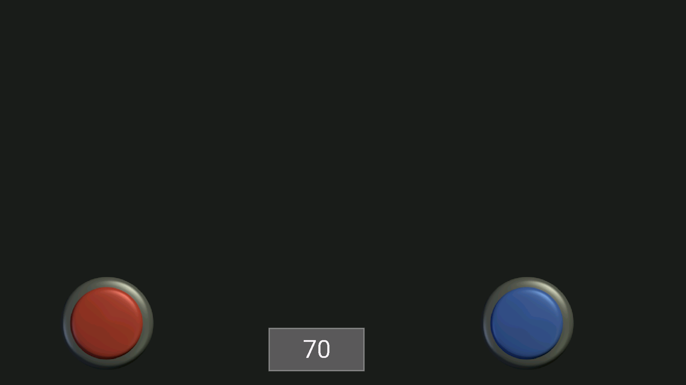
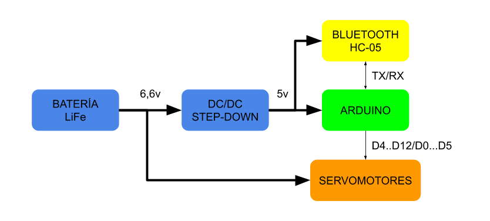
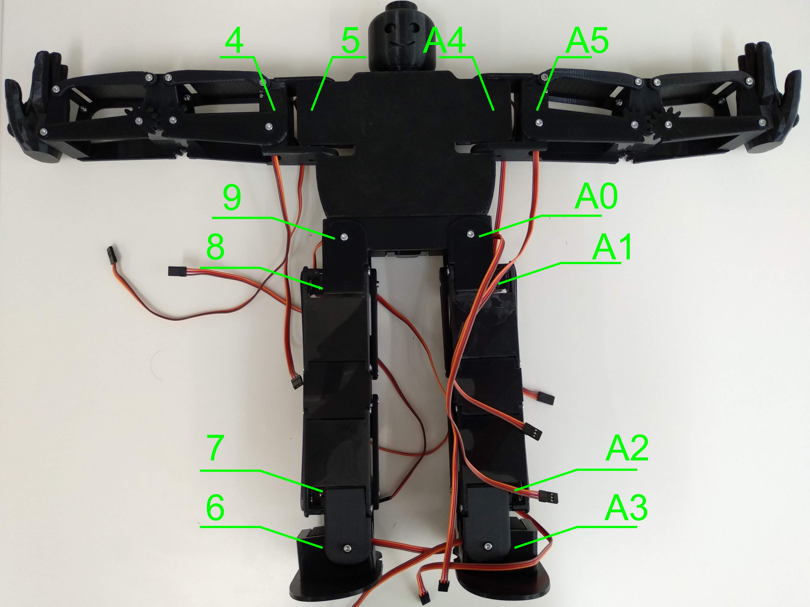
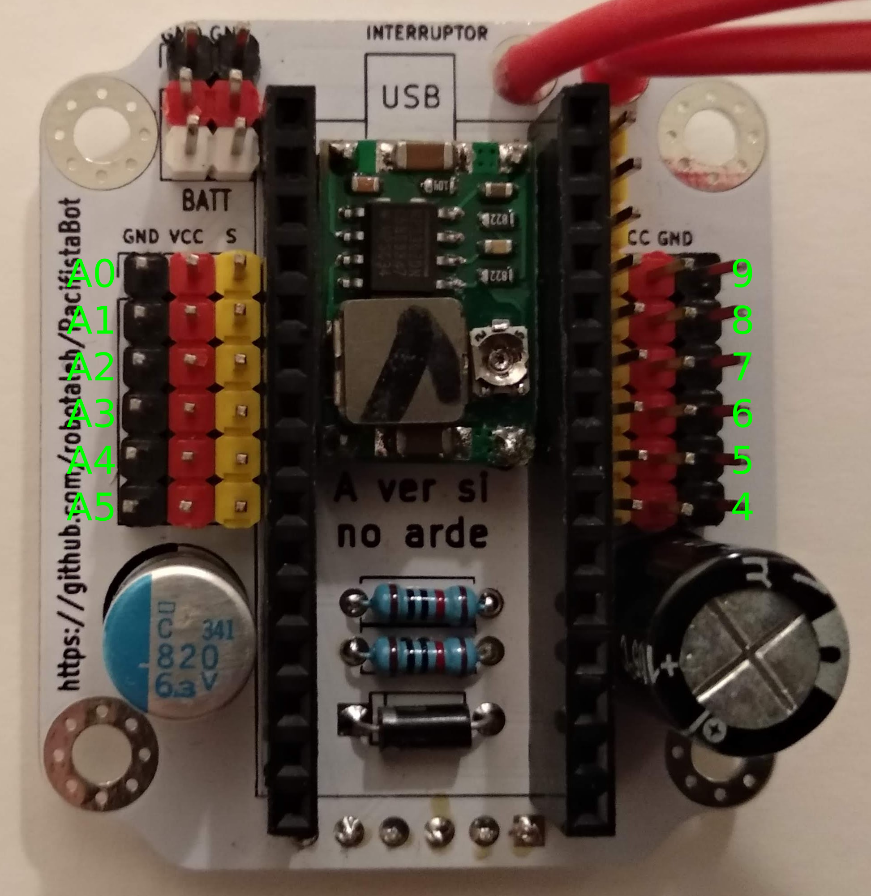

# PacifistaBot: Montaje y Calibración

El montaje y calibración del robot humanoide es relativamente sencillo y adecuado para la inicialización. Pero es necesario seguir unos pasos o unas indicaciones para simplificar el trabajo.

### Montaje

El montaje del robot está compuesto de dos partes, una mecánica y otra electrónica. Este trabajo se puede empezar por cualquiera de las dos partes para unirlas al finalizarlas. En el video que han realizado los de [OPRobots](https://twitter.com/OPRobots) al principio se puede ver el montaje mecánico y al final el montaje electrónico.

También está documentado mediante twitter por [ionhs_FP](https://twitter.com/ionhs_FP) el proceso de montaje del robot humanoide:

- Parte [mecánica en twitter](https://twitter.com/ionhs_FP/status/1115969155814121472)
- Parte [electrónica en twitter](https://twitter.com/ionhs_FP/status/1116700309957509120)

### Ajuste y Calibración

Es importante tomarse el tiempo necesario para poder realizar el ajuste y la calibración lo mejor posible en el robot. Gracias a esto el uso será menos accidentado, habrá menos roturas y podremos tener el robot operativo una mayor cantidad de tiempo.

1. ##### Ajustes y holguras

   Durante el montaje hay 2 tipos de unioses, algunas son fijas y otras requieren cierta holgura para posibilitar el movimiento. Las que requieren holgura, hay que buscar el equilibrio para que por una parte las piezas estén bien posicionadas y por otra, no tengan una gran fricción durante el movimiento. Los codos y rodillas del robot como los de la foto, son los puntos donde hace falta un ajuste más fino.

   

2. ##### Límites mecánicos

   Tras realizar el montaje se ha de comprobar a mano (sin meterle tensión) todos los movimientos del robot, comprobando que cada servomotor puede realizar los movimientos sin problemas. En el ejemplo de abajo se comprueba que el brazo puede realizar los 2 movimientos sin problemas: Poder plegarse contra el cuerpo y poder extenderse más que completamente.

   |                       Brazo recogido                       |                       Brazo extendido                       |
   | :--------------------------------------------------------: | :---------------------------------------------------------: |
   |  |  |

   En el caso que algún servomotor no tuviera todo el recorrido mecánico, habría que desmontar la pieza impresa, mover el servomotor y volver a montar la pieza, hasta que tuviera todo el recorrido mecánico. En el caso de no realizarse este tipo de comprobaciones, es muy posible que al poco de empezar a usarse alguna pieza se rompa. En la imagen se puede ver la rotura de la pieza de plástico del codo del robot.

   

3. ##### Límites por software

   Una vez que se ha comprobado que mecánicamente está bien montado y con los límites ajustados, se ha de identificar los límites por software. Para ello se cargará un programa simple llamado [Configuración](./../source_code/Configuracion/Configuracion.ino), en el que se usará el pin A1 de la placa electrónica para conectar los servomotores y comunicarse por bluetooth:

   - Ordenador: [ScriptCommunicatorSerie](https://github.com/szieke/ScriptCommunicator_serial-terminal), [Putty](https://www.putty.org/)...
   - Android: [Bluetooth Electronics](https://www.keuwl.com/apps/bluetoothelectronics/)...

    De esta manera se irá viendo  la posición del servomotor por serie y desde el PC o móvil se podrá desplazar grado a grado la posición. Para conocer el ángulo límite del robot se ha de ir sustituyendo en el pin A1 uno a uno todos los servomotores del robot.

   |           Placa alimentada con conexión al pin A1            |               Captura de la pantalla del movil               |
   | :----------------------------------------------------------: | :----------------------------------------------------------: |
   |  |  |

   En las imágenes de arriba se muestra el servomotor del hombro derecho del robot conectado a la placa en el pin A1. También la imagen del la aplicación del móvil ([Descargar panel](../source_code/BluetoothElectronics/Bluetooth_Electronics_Panels_0003.kwl) de BluetoothElectronics) donde se ve que el servomotor está a 70º y mediante los 2 botones se puede desplazar el servomotor hacia arriba o abajo. Esta información (los límites de cada servomotor) hay que ir consiguiéndola de cada uno de los servomotores del robot.

4. ##### Tecnología y Diagrama de Bloques

   Mediante el siguiente diagrama de bloques se puede ver los bloques tecnológicos y las relaciones que hay entre ellos en el robot humanoide.

   

   Los archivos originales del [diagrama de bloques](../pcb_files/Pacifista_BT/Diagrama_Bloques_Pacifista_BT.svg) han sido creados en Inkscape en el formato SVG.

5. ##### Conexión de los Servomotores

   Para poder mover el robot en su conjunto es imprescindible conectar todos los servomotores a la placa controladora.

   | Pinout del Robot                                        | Pin out de la PCB                                          |
   | ------------------------------------------------------- | ---------------------------------------------------------- |
   |  |  |

   Los archivos originales del [PinoutRobot](./Montaje/Programacion_Calibracion/RobotPosicionServo.svg) así como el del [PinoutPCB](./Montaje/Programacion_Calibracion/PCBnumeracionServos.svg) han sido creados en Inkscape en el formato SVG.

6. ##### Cargar programa principal

   El programa principal necesita que se tengan cargadas 3 librerias (Octosnake, Wire y Servo) en el IDE de Arduino. El [programa principal](./../source_code/Programa_Principal_OPRobots/) está estructurado en 5 pestañas (Main, Comunicaciones, Init, Movimientos y Servocontrol) que se cargarán al abrir el archivo Main. Una vez abierto hay que ir a la pestaña Init para definir las posiciones de los 12 servos, que hemos obtenido en el punto **3 Limites por servo**. Hay que tener en cuenta que en la posición de init el robot ha de estar depie (las piernas extendidas) y con los brazos recogidos, por lo que los límites que pongamos serán para obtener esa posición.

   Tras definir la posición inicial hay que ir a la pestaña Movimientos y a la función posicion_hombros y en el switch/Case definir la posición de los hombros adelante y atras. En caso de no hacerlo la función hombro no funciona correctamente y además no se puede volver a poner los hombros en su posición central.

   Otro de los movimientos que hay que ajustar es el de agachado. En la pestaña Movimientos y en la función posicion_agachado hay 8 arrays donde se establece como han de estar 8 servomotores al finalizar la posición de agachado. Estas 8 posiciones conviene ajustarlas a nuestras necesidades para que el robot flexe correctamente las rodillas y quede agachado.

